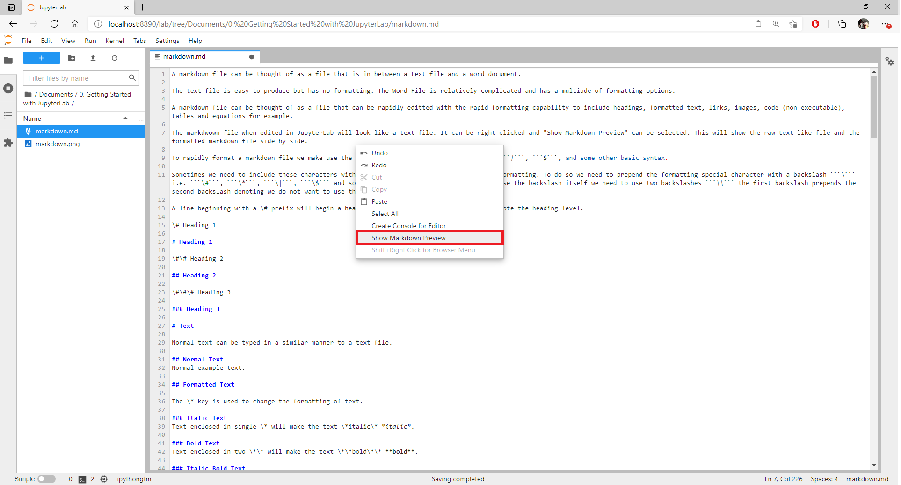
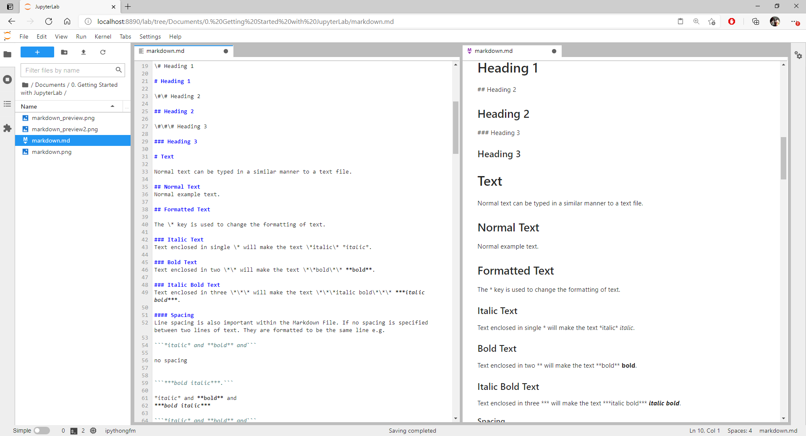
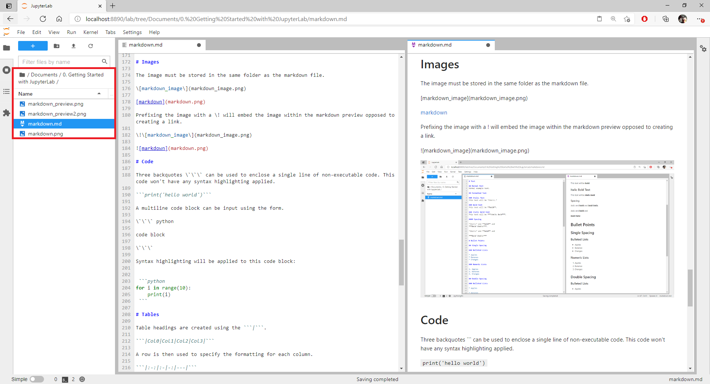
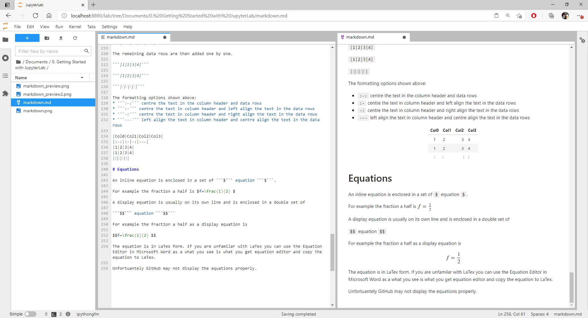

A markdown file can be thought of as a file that is in between a text file and a word document. 

The text file is easy to produce but has no formatting. The Word File is relatively complicated and has a multiude of formatting options.

A markdown file can be thought of as a file that can be rapidly editted with the rapid formatting capability to include headings, formatted text, links, images, code (non-executable), tables and equations for example.

The markdown file when edited in JupyterLab will look like a text file. It can be right clicked and "Show Markdown Preview" can be selected. 



This will show the raw text like file and the formatted markdown file side by side.



To rapidly format a markdown file we make use the following characters ```#```, ```*```, ```|```, ```$```, and some other basic syntax.

Sometimes we need to include these characters within our file outwith their use for file formatting. To do so we need to prepend the formatting special character with a backslash ```\``` i.e. ```\#```, ```\*```, ```\|```, ```\$``` and some other basic syntax. When we wish to use the backslash itself we need to use two backslashes ```\\``` the first backslash prepends the second backslash denoting we do not want to use the second backslash for formatting. 

A line beginning with a \# prefix will begin a heading. The number of \# prefixes will denote the heading level.

\# Heading 1

# Heading 1

\#\# Heading 2

## Heading 2

\#\#\# Heading 3

### Heading 3

# Text

Normal text can be typed in a similar manner to a text file.

## Normal Text
Normal example text.

## Formatted Text

The \* key is used to change the formatting of text.

### Italic Text
Text enclosed in single \* will make the text \*italic\* *italic*.

### Bold Text
Text enclosed in two \*\* will make the text \*\*bold\*\* **bold**.

### Italic Bold Text
Text enclosed in three \*\*\* will make the text \*\*\*italic bold\*\*\* ***italic bold***.

#### Spacing
Line spacing is also important within the Markdown File. If no spacing is specified between two lines of text. They are formatted to be the same line e.g.

```*italic* and **bold** and``` 

no spacing


```***bold italic***.```

*italic* and **bold** and
***bold italic***

```*italic* and **bold** and``` 

spacing

```***bold italic***.```

*italic* and **bold** and 

***bold italic***

# Bullet Points

## Unspaced

### Bulleted Lists

The \* can also be used only as a prefix for each item in a bulleted list. If no spacing is specified the list will be unspaced.

```* Apples```

no spacing

```* Bananas```

no spacing

```* Oranges```

no spacing

* Apples
* Bananas
* Oranges

### Numeric Lists

The list can also be created by using a numeric full stop prefix.

```1. Apples```

no spacing

```2. Bananas```

no spacing

```3. Oranges```

no spacing

1. Apples
2. Bananas
3. Oranges

## Single Spaced Lists 

### Bulleted Lists

The \* can also be used only as a prefix for each item in a bulleted list. If spacing is specified the list will be  singly spaced.

```* Apples```

spacing

```* Bananas```

spacing

```* Oranges```

spacing

* Apples

* Bananas

* Oranges

### Numeric Lists

```1. Apples```

spacing

```2. Bananas```

spacing

```3. Oranges```

spacing

1. Apples

2. Bananas

3. Oranges

# Links

Links can be added be enclosing the name of the link in square brackets and enclosing the website in circular brackets.

\[GitHub\](https://github.com/)

[GitHub](https://github.com/)

# Images

The image must be stored in the same folder as the markdown file.

\[markdown_image\](markdown_image.png)

[markdown](markdown.png)

Prefixing the image with a \! will embed the image within the markdown preview opposed to creating a link.

\!\[markdown_image\](markdown_image.png)



When uploaded to gitHub the image and the markdown file must be in the same folder (repository) for the image to display.

# Code

Three backquotes \`\`\` can be used to enclose a single line of non-executable code. This code won't have any syntax highlighting applied.

```print('hello world')```

A multiline code block can be input using the form.

\`\`\` python

code block

\`\`\`

Syntax highlighting will be applied to this code block:


 ```python    
for i in range(10):
    print(i)
 ```

# Tables

Table headings are created using the ```|```.

```|Col0|Col1|Col2|Col3|```

A row is then used to specify the formatting for each column.

```|:-:|:-|-:|---|```

The remaining data rows are then added one by one.

```|1|2|3|4|```

```|1|2|3|4|```

```|⁝|⁝|⁝|⁝|```

The formatting options shown above:
* ```:-:``` centre the text in the column header and data rows
* ```:-``` centre the text in column header and left align the text in the data rows
* ```-:``` centre the text in column header and right align the text in the data rows
* ```---``` left align the text in column header and centre align the text in the data rows

|Col0|Col1|Col2|Col3|
|:-:|:-|-:|---|
|1|2|3|4|
|1|2|3|4|
|⁝|⁝|⁝|⁝|

# Equations

An inline equation is enclosed in a set of ```$``` equation ```$```. 

For example the fraction a half is $f=\frac{1}{2} $

A display equation is usually on its own line and is enclosed in a double set of

```$$``` equation ```$$```

For example the fraction a half as a display equation is

$$f=\frac{1}{2} $$

The equation is in LaTex form. If you are unfamilar with LaTex you can use the Equation Editor in Microsoft Word as a what you see is what you get equation editor and copy the equation to LaTex.

The equations display like the following in JupyterLab.



Unfortunately GitHub may not display the equations properly.